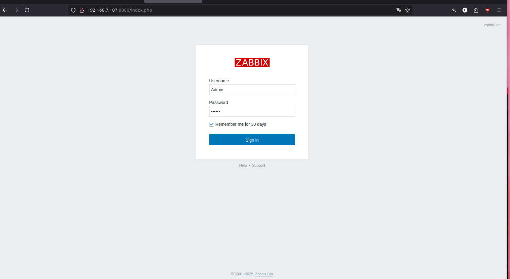
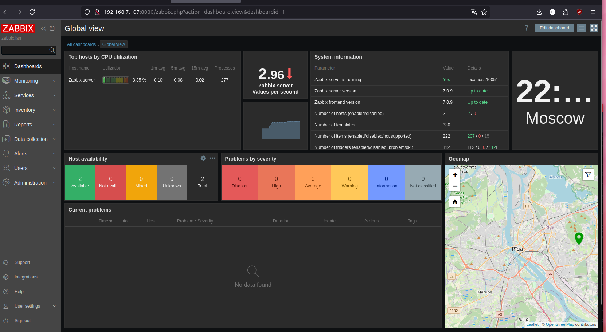
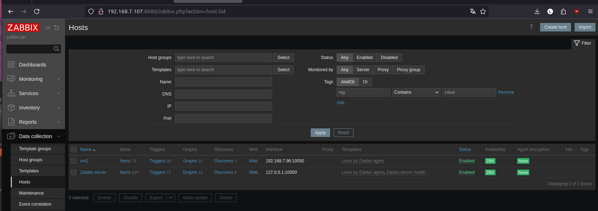
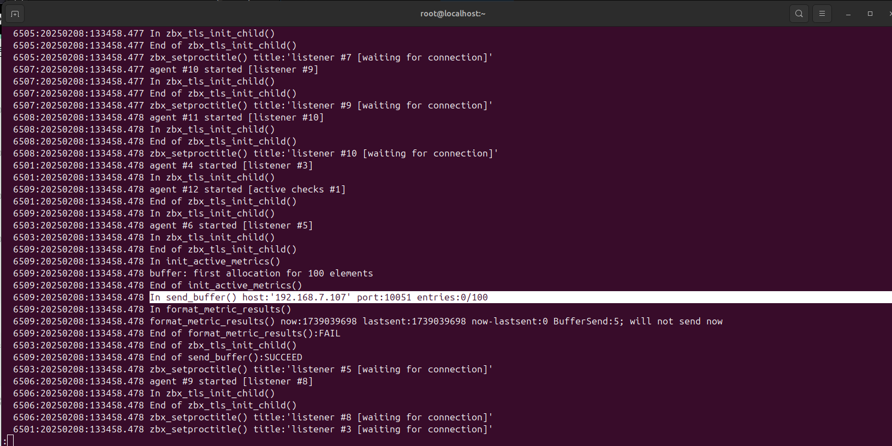
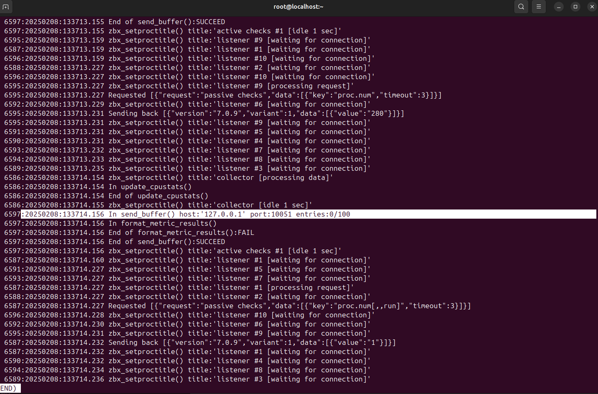
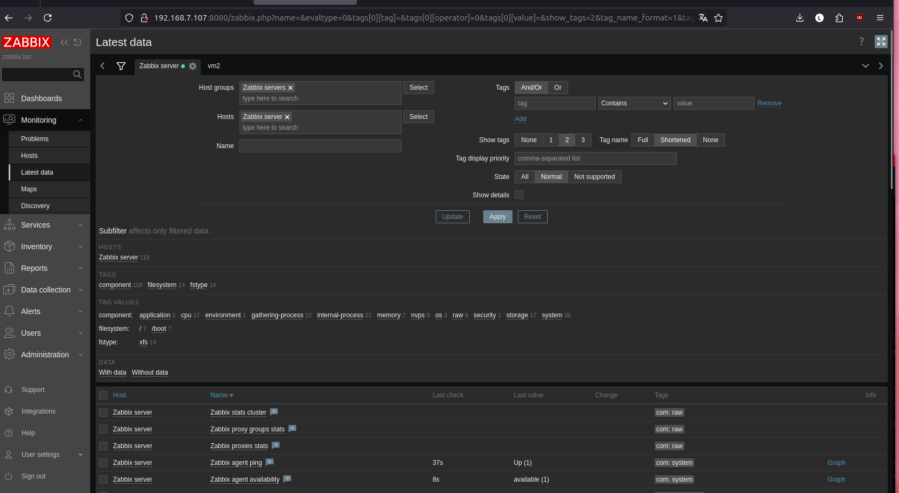
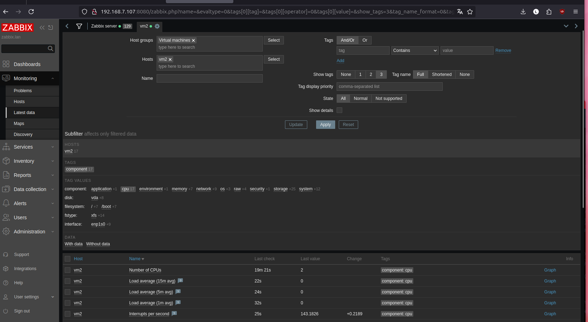

# Домашнее задание к занятию «Система мониторинга Zabbix» - Бетко Алексей

### Задание 1

Установите Zabbix Server с веб-интерфейсом.

Выполненые команды

1. rpm -Uvh https://repo.zabbix.com/zabbix/7.0/oracle/8/x86_64/zabbix-release-latest-7.0.el8.noarch.rpm
2. dnf clean all 
3. dnf module switch-to php:8.2 
4. dnf install zabbix-server-pgsql zabbix-web-pgsql zabbix-nginx-conf zabbix-sql-scripts zabbix-selinux-policy zabbix-agent 
5. dnf module switch-to postgresql:15
6. dnf module install postgresql:15
7. /usr/bin/postgresql-setup --initdb
8. systemctl enable --now postgresql
9. sudo -u postgres createuser --pwprompt zabbix
10. sudo -u postgres createdb -O zabbix zabbix 
11. zcat /usr/share/zabbix-sql-scripts/postgresql/server.sql.gz | sudo -u zabbix psql zabbix 
12. nano  /etc/zabbix/zabbix_server.conf изменение DBPassword, DBport, DBSchema
13. nano /etc/nginx/conf.d/zabbix.conf раскоментирован порт и имя сервера
14. systemctl enable --now nginx.service
15. systemctl enable --now zabbix-server zabbix-agent nginx php-fpm

### Задание 2

Установите Zabbix Agent на два хоста.

#### Data Collection -> Hosts

#### Агент VM2

#### Агент на Zabbix server

#### Monitoring > Latest

1. rpm -Uvh https://repo.zabbix.com/zabbix/7.0/oracle/8/x86_64/zabbix-release-latest-7.0.el8.noarch.rpm
2. dnf clean all 
3. dnf install zabbix-agent 
4. nano /etc/zabbix/zabbix_agentd.conf настройка конфига
5. systemctl enable --now zabbix-agent